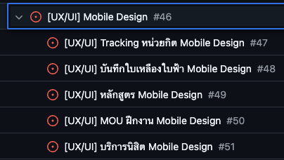
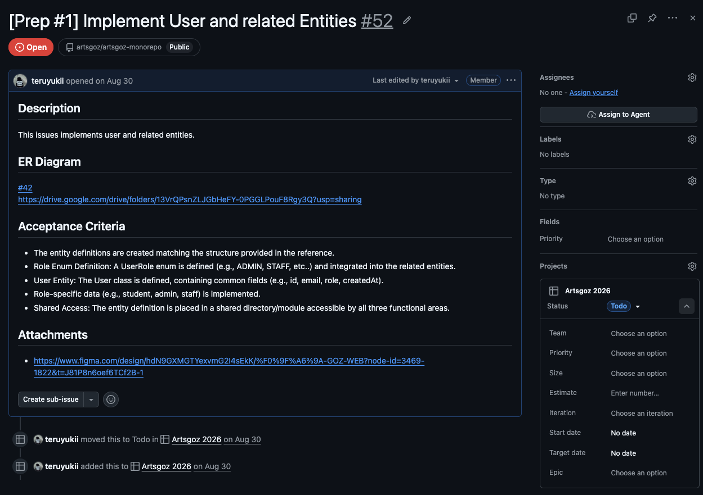
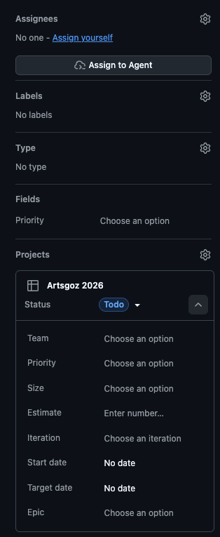
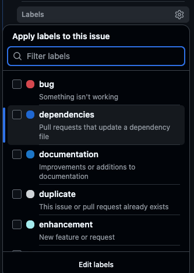
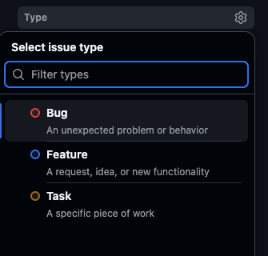
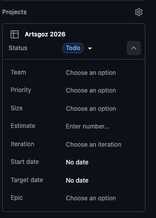
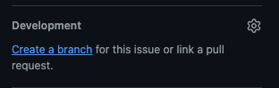
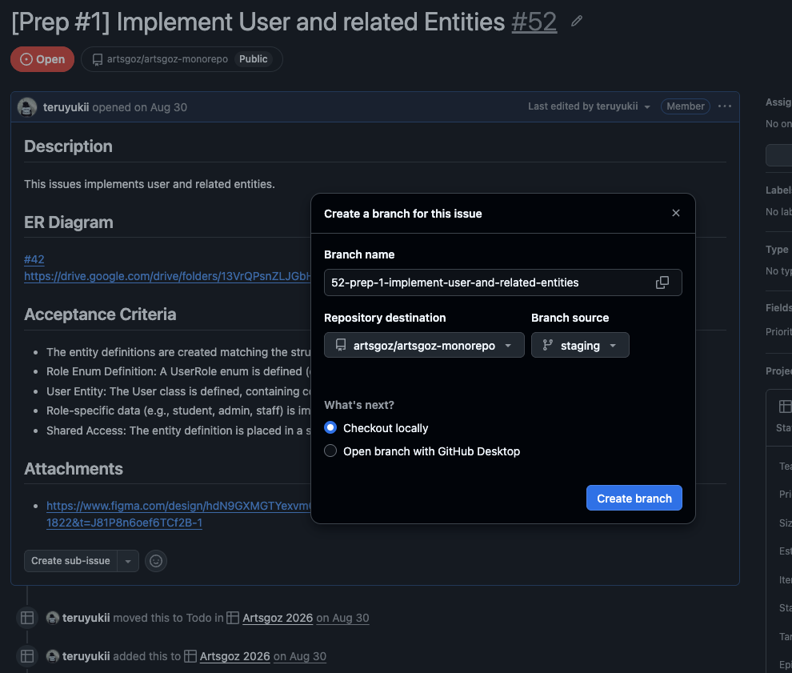

# เกี่ยวกับ Github Issue

Github Issue คือ project management tool อยู่ใน git repo ใช้ track bugs, suggest new features, organize tasks, etc...

ตอนที่เราอยากจะ implement feature/เริ่มทำงานใด ๆ เราอาจจะต้องเริ่มจากการที่เราได้รับ requirements มาจากทีม (PM/Product Owner) เราไม่ได้คิดขึ้นมาเองแล้ว implement เลย ทีม PM/PO จะเขียนการ์ด รวม requirement/feature/งานที่ dev ต้องทำเข้ามารวมอยู่ใน issue หรือที่เรียกว่า การ์ด

จริง ๆ ตัว github issue ไม่ได้จำกัดแค่งานที่ต้องเขียนโค้ด หรือ งานของ dev เท่านั้น ทีมอื่นก็สามารถมาใช้ได้เช่นกัน เช่น UX/UI อาาจะเข้ามาดูการ์ดได้ว่ามีงานไหนที่ PM มอบหมายมาให้หรือไม่

# ส่วนประกอบใน github issue

ใน issue หรือ การ์ดหนึ่งก็จะระบุ scope ของงานนั้น ๆ แล้วใน issue หรือ การ์ดนั้น ๆ ก็สามารถแตกงานย่อย ๆ ลงมาได้อีกที เช่น งาน `[UX/UI] Mobile Design` พอเรามาดู จะเห็นได้ว่า scope งานนี้มันใหญ่มาก คือให้ design หน้า mobile เว็บเรามีตั้งหลายหน้า เราจะเขียนการ์ดรวมเป็นก้อนแบบนี้ก็อาจจะใหญ่เกินไป เราสามารถแตกการืดนี้ออกมาได้โดยการสร้าง sub-issue ไว้ในการืดนี้



## Interface ภายใน issue

จากรูปด้านล่างเราจะเห็นหน้าตาภายใน Issue ว่ามีส่วนประกอบอะไรบ้าง



### Description

ส่วนนี้เป็นส่วนที่เราเอาไว้ดูว่า PM/PO เขียนอะไรมาไว้บ้าง ทาง pm/po ก็จะเขียนอธิบายว่างานนี้เกี่ยวกับอะไร ขอบเขตการทำงานเป็นแบบไหน โน้ต คำเตือน หรือลิงก์แนบ

ส่วนใหญ่ที่ pm/po จะเขียนใน description จะมี

- description ใช้อธิบายรายละเอียดการ์ดนี้
- accentance criteria คือ จะต้องทำอะไรบ้างถึงจะถือว่างานเสร็จ
- attachments ใช้แนบลิงก์ที่คิดว่า assignee ต้องเข้าไปดูเพื่อเป็น reference
- note โน้ตเพิ่มเติม

ส่วนถัดไปที่สำคัญเหมือนกันคือ ด้านขวา



### Assignee

ใครเป็นคนรับงานนี้ไปทำ

### Labels

|          |      |
| ----------------------------------- | ------------------------------ |
| Labels แปะไว้ว่าอันนี้เกี่ยวกับอะไร | Type บอกว่างานนี้เป็นประเภทไหน |

### Projects

ตรงนี้ก็สำคัญ สำหรับรายละเอียดว่าแต่ละอันมีดังนี้



- Team: ทีมที่เป็นเจ้าของงานนี้ >> Product (PM/PO), Engineering (Dev), Design (UX/UI)
- Priority: ความสำคัญของงานนี้ P0 คือสำคัญสุด แล้วก็ไล่รองลงมา
- Epic: มองเหมือนว่า epic คือ parent ว่าการ์ดนี้อยู่ในหมวดหมู่ไหน

### Development

ส่วนนี้ สำหรับ dev ที่จะรับงานใน issue มา implement ให้กดสร้างจากตรงนี้ แล้วค่อยแยกไปทำงานใน branch ของตัวเอง



> [!Note]
> สำหรับใครที่สงสัยว่า branch คืออะไร ทำไมต้องมี branch [อ่านที่นี่: Branch](../branch/index)

วิธีตั้งชื่อ Branch ให้วาง format ตามนี้

```
[type]/[issue-id]-[issue-title]
```

ตัวอย่าง
พอเรากด create a branch



มันจะโชว์ default ชื่อมาให้เราเป็น [issue-id]-[issue-title] มาแล้ว สิ่งที่เราต้องเพิ่มคือ เพิ่ม type

Type มีตามนี้

- feature/ สำหรับ implement ฟีเจอร์
- chore/ สำหรับ เพิ่ม config หรืองานอื่น ๆ
- infra/ สำหรับงาน infra

อย่างในรูปเป็น issue ที่ implement user entities เป็นประเภทที่ต้อง implement ก็ให้เลือกเป็น type feature จะได้เป็น

`feature/52-prep-1-implement-user-and-related-entities`

ส่วนถัดมาคือ Repository destination งาน frontend ให้เลือก `artsgoz/artsgoz-monorepo` ส่วน backend ให้เลือก `artsgoz/artsgoz-backend`

Branch Source ให้เลือก `develop`

แล้วกด create branch หลังจากนั้นมันก็จะโชว์ command ที่ให้เราไป checkout branch เพื่อไป implement ใน branch นั้น ๆ ต่อ

# เสร็จงานแล้วทำอะไรต่อ

หลังจากที่เรา implement feature/task ต่าง ๆ แล้วใน branch เราอยากเอาของไปรวมใน branch develop/staging เราจะทำยังไงต่อ? >> [ดู Github Pull Request](../gh-pr/index)
